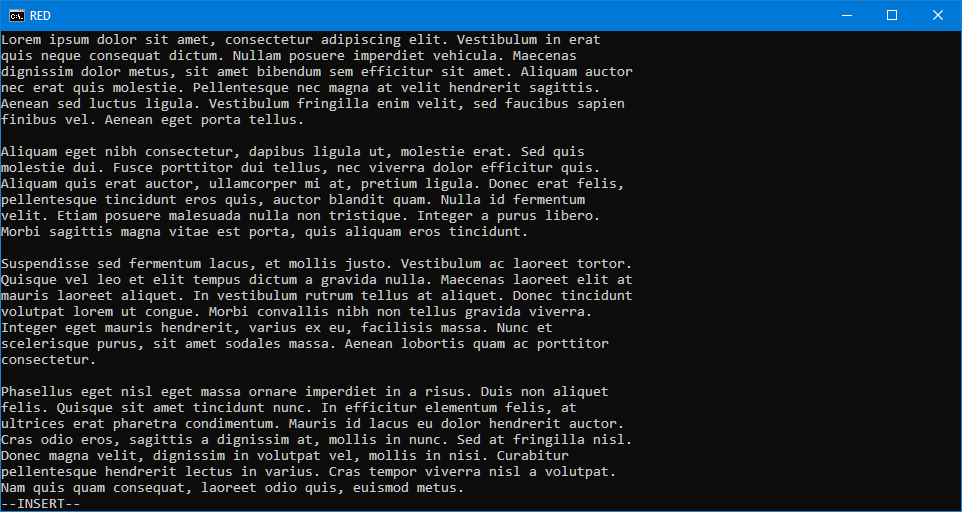

# red

Red is a mimimalist text editor for the Windows operating system using the command line interface.



[YouTube Demo](https://youtu.be/eNP3JyuvI1I)

## Building

Currently tested using Visual Studio 2019

```bat
red>md build
red>cmake-gui .
red>rem configure and generate build
red>cmake --build build
```

## Using

Red is to be used on the command line, and requires a file to open or create as an argument.

```sh
Usage: red <filename>
```

There are currently two modes supported, Normal and Insert. The editor initially starts in Normal mode
where commands can be entered.

### Normal Commands

| Key | Command | Description |
| --- | ------- | ----------- |
| H   | backward char | Moves the cursor to the previous character. Wraps to end of previous line if at the beginning |
| J   | forward line | Moves the cursor to next line. Does nothing when on the last line |
| K   | backward line | Moves the cursor to the previous line. Moves to the beginning when on the first line |
| L   | forward char | Moves the cursor forward a character. Wraps to the next line if at the end of a line |
| C-S | save file | Saves the current file. (Control-S) |
| C-Q | quit | Exits the application. If unsaved changes use multiple times to force quit |

## Insert Commands

| Key | Command | Description |
| --- | ------- | ----------- |
| Esc | leave insert | Exits insert mode and returns to normal mode |
| Enter | newline | Inserts a newline character into the buffer |
| Backspace | backspace | Erases the previous character |
